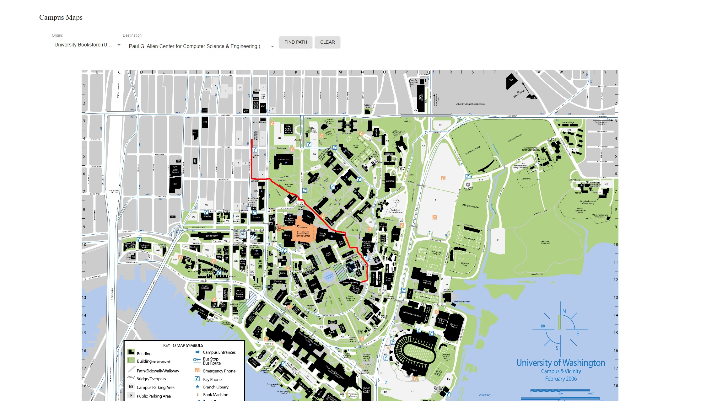

# CampusMaps

An application that finds the shortest route from one building to another building. Uses React for the frontend web application that sends HTTPS Requests to retrieve information about the avalible buildings and paths.
Uses a Java Spark Server as the backend. Run src/main/java/campuspaths/SparkServer.java to run the server and use npm install, then npm start in src/main/campuspaths to start the react application.

